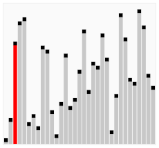
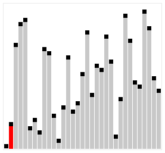

**정렬 알고리즘 정리**

1. [버블정렬(Bubble sort)](#버블정렬)
2. [선택정렬(Selection sort)](#선택정렬)
3. [삽입정렬(Insertion sort)](#삽입정렬)
4. [병합정렬(Merge sort)](#병합정렬)
5. [퀵정렬(Quick sort)](#퀵정렬)

---

### 개요


어떤 데이터들이 주어졌을 때 이를 정해진 순서대로 나열하는 문제이다. 데이터를 정렬해야 하는 이유는 탐색을 위해서이다. 컴퓨터는 이론상 무한 개의 데이터를 다룰 수 있어야 한다. 탐색할 대상 데이터가 정렬되어있지 않다면 순차 탐색 이외에 다른 알고리즘을 사용할 수 없지만 데이터가 정렬되어 있다면 이진 탐색이라는 강력한 알고리즘을 사용할 수 있다.

대표적인 정렬의 종류로 버블정렬, 퀵정렬, 삽입정렬 등이 있다.

---

### 버블정렬



버블정렬은 거의 모든 상황에서 최악의 성능을 보여준다. 단, 이미 정렬된 자료에서는 1번만 돌면 되기 때문에 최선의 성능을 보여준다. 시간복잡도는 O(n²).

버블정렬은 다음과 같은 순서로 작동한다.

```
1. 앞에서부터 현재 원소와 바로 다음의 원소를 비교
2. 현재 원소가 다음 원소보다 크면 원소를 교환
3. 다음 원소로 이동하여 해당 원소와 그 다음 원소를 비교
```

버블벙렬의 구현 코드는 다음과 같다.

```java
private static void bubble_sort(int[] a, int size) {
    for (int i = 1; i < size; i++) {
        for (int j = 0; j < size - 1; j++) {
            if (a[j] > a[j + 1]) {
                swap(a, j, j + 1);
            }
        }
    }
}

private static void swap(int[] a, int i, int j) {
    int temp = a[i];
    a[i] = a[j];
    a[j] = temp;
}
```

---

### 선택정렬


주어진 자료들 중에 현재 위치에 맞는 자료를 찾아 선택하여 위치를 교환하는 알고리즘이다. 1번부터 끝까지 훑어서 가장 작은게 1번째, 2번부터 끝까지 훑어서 가장 작은게 2번째...(n-1)번 반복한다. 시간복잡도는 O(n²).

선택정렬은 다음과 같은 순서로 작동한다.

```
1. 주어진 리스트에서 최솟값을 찾는다
2. 최솟값을 맨 앞자리의 값과 교환한다.
3. 맨 앞자리를 제외한 나머지 값들 중 최솟값을 찾아 위와 같은 방법으로 반복
```

선택정렬의 구현 코드는 다음과 같다.

```java
private static void selection_sort(int[] a, int size) {
    for (int i = 0; i < size - 1; i++) {
        int min_index = i;

        for (int j = i + 1; j < size; j++) {
            if (a[j] < a[min_index]) {
                min_index = j;
            }
        }

        swap(a, min_index, i);
    }
}

private static void swap(int[] a, int i, int j) {
    int temp = a[i];
    a[i] = a[j];
    a[j] = temp;
}
```

---

### 삽입정렬



주어진 자료의 모든 요소를 앞에서부터 차례대로 정렬된 부분과 비교하여 자신의 위치를 찾아 삽입하는 정렬이다. 시간복잡도는 O(n²). O(n²)중 빠른 편이나 자료구조에 따라서 작은 게 뒤쪽에 몰려있으면 걸리는 시간이 크다. 이미 정렬되어 있는 자료구조에 자료를 하나씩 삽입, 제거하는 경우에는 최고의 정렬 알고리즘이다.

삽입정렬은 다음과 같은 순서로 작동한다.

```
1. 현재 타겟이 되는 숫자와 이전 위치에 있는 원소들을 비교한다.
2. 타겟이 되는 숫자가 이전 위치에 있던 원소보다 작다면 위치를 서로 교환한다.
3. 그 다음 타겟을 찾아 위와 같은 방법으로 반복한다.
```

삽입정렬의 구현 코드는 다음과 같다.

```java
private static void insertion_sort(int[] a, int size) {
    for (int i = 1; i < size; i++) {
        int target = a[i];

        int j = i - 1;

        while (j >= 0 && target < a[j]) {
            a[j + 1] = a[j];
            j--;
        }

        a[j + 1] = target;
    }
}
```

### 병합정렬


원소 개수가 1 또는 0이 될 때까지 두 부분으로 쪼개서 자른 순서의 역순으로 크기를 비교해 병합한다. 병합된 부분 안은 이미 정렬되어 있으므로 전부 비교하지 않아도 제자리를 찾을 수 있다. 같은 방식으로 반복하여 병합하기 때문에 보통 재귀함수로 구현한다. 시간복잡도는 항상 O(nlogn)이다.

병합정렬은 다음 순서로 작동한다.

```
1. 주어진 리스트를 절반으로 분할하여 부분리스트로 나눈다.
2. 해당 부분리스트의 길이가 1이 아니라면 1번 과정을 되풀이한다.
3. 인접한 부분리스트끼리 정렬하여 합친다.
```

병합정렬의 구현 코드는 다음과 같다.

```java
private static void merge_sort(int[] a, int left, int right) {
    if (left == right) {
        return;
    }

    int mid = (left + right) / 2;

    merge_sort(a, left, mid);
    merge_sort(a, mid + 1, right);

    merge(a, left, mid, right);
}

private static void merge(int[] a, int left, int mid, int right) {
    int L = left;
    int R = mid + 1;
    int idx = left;

    while (L <= mid && R <= right) {
        if (a[L] <= a[R]) {
            sorted[idx] = a[L];
            idx++;
            L++;
        } else {
            sorted[idx] = a[R];
            idx++;
            R++;
        }
    }

    if (L > mid) {
        while (R <= right) {
            sorted[idx] = a[R];
            idx++;
            R++;
        }
    } else {
        while (L <= mid) {
            sorted[idx] = a[L];
            idx++;
            L++;
        }
    }

    for (int i = left; i <= right; i++) {
        a[i] = sorted[i];
    }
}
```

### 퀵정렬


퀵정렬도 병합정렬과 마찬가지로 분할정복을 통한 정렬이다. 평균적인 상황에서 최고의 성능을 나타낸다. 적절한 원소 하나를 기준(피벗)으로 삼아 그보다 작은 것을 앞으로 빼내고, 그 뒤에 피벗을 옮겨 피벗보다 작은 것, 큰 것으로 나눈 뒤 나누어진 각각에서 다시 피벗을 잡아 정렬한다. 시간복잡도는 평균적으로 O(nlogn).

병합정렬과 차이점은 병합정렬은 분할 단계에서는 아무것도 하지않고 병합하는 단계에서 정렬을 수행하지만, 퀵정렬은 분할 단계에서 작업들을 수행하고 병합시에는 아무것도 하지않는다는 점이다.

퀵정렬은 다음과 같은 순서로 작동한다.

```
1. 피벗을 하나 선택한다.
2. 피벗을 기준으로 양쪽에서 피벗보다 큰 값, 혹은 작은 값을 찾는다. 왼쪽에서부터는 피벗보다 큰 값을 찾고, 오른쪽에서부터는 피벗보다 작은값을 찾는다.
3. 양 방향에서 찾은 두 원소를 교환한다.
4. 왼쪽에서 탐색하는 위치와 오른쪽에서 탐색하는 위치가 엇갈리지 않을 때까지 2번으로 돌아가 위 과정을 반복한다.
5. 엇갈린 기점을 기준으로 두 개의 부분리스트로 나누어 1번으로 돌아가 해당 부분리스트의 길이가 1이 아닐 때까지 1번 과정을 반복한다.
6. 인접한 부분리스트끼리 합친다.
```

피벗의 값을 첫 번째 원소로 설정하는 Hoare 파티션 방식과, 피벗의 값을 마지막 원소로 설정하는 Lomuto 파티션 방식으로 구현할 수 있다.

퀵정렬의 가장 간단한 알고리즘인 Lomuto 파티션 방식의 구현 코드는 다음과 같다.

```java
// 퀵정렬(Lomuto 파티션)
private static void quick_sort(int[] a, int left, int right) {
    if(left >= right) {
        return;
    }

    int pivot = partition(a, left, right);

    quick_sort(a, left, pivot-1);
    quick_sort(a, pivot+1, right);
}

private static int partition(int[] a, int left, int right) {
    int pivot = a[right];
    int L = left;
    int R = right;

    while(L < R) {
        while(a[L] < pivot && L < R) {
            L++;
        }

        while(a[R] >= pivot && L < R) {
            R--;
        }

        swap(a, L, R);
    }

    swap(a, right, R);

    return R;
}

private static void swap(int[] a, int i, int j) {
    int tmp = a[i];
    a[i] = a[j];
    a[j] = tmp;
}
```
