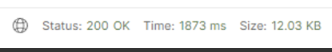
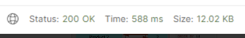

**Covering Index**

<br>

페이징 성능을 개선할 방법으로는 NoOffset 페이징, 커버링 인덱스를 사용하는 것이 있다.

NoOffset페이징은 페이지 번호를 의미하는 offset을 쓰지않고, 그대신 이전 페이지의 끝부분을 가지고있다가 조회의 첫 부분을 찾을 때 사용하는 것이다. 이 방법은 특정 페이지별로 조회가 안된다는 단점이 있다.

현재 진행중인 프로젝트에서는 해당 방법은 사용할 수 없어서 커버링 인덱스를 사용해 개선했다.

커버링 인덱스란 쿼리를 충족시키는 데 필요한 데이터를 갖고 있는 인덱스를 말한다.

커버링 인덱스를 이용해 출력할 데이터들의 id값을 조회한 후, 해당 id값이 담긴 List를 이용해 데이터를 조회하는 방식으로 구현했다.

이렇게 하면 커버링 인덱스를 구할 때 where, order by, offset, limit를 다 처리하여 id값만 빠르게 가져오고, 걸러진 데이터들에 대해서만 접근하기 때문에 성능 개선을 할 수 있다.

Querydsl을 이용해 구현했고, 코드의 예시는 다음과 같다.

```java
private List<RankingResponseDto> getRankingCoveringIndex(String country, String author, Pageable pageable) {
    JPAQueryFactory query = querydslConfig.jpaQueryFactory();

    // 커버링 인덱스로 대상의 id값만 가져온다.
    List<String> idList = query
        .select(book.id)
        .from(book)
        .where(
            countryEq(country),
            authorEq(author)
        )
        .orderBy(book.rate.desc())
        .offset(pageable.getOffset())
        .limit(pageable.getPageSize())
        .fetch();

    // 걸러진 id값을 이용해 데이터에 접근하여 반환한다.
    return query
        .select(Projections.constructor(RankingResponseDto.class,
            book.name,
            book.rate,
            book.author,
            book.country
        ))
        .from(book)
        .where(book.id.in(idList))
        .orderBy(book.rate.desc())
        .fetch();
}
```

- 커버링 인덱스를 적용하기 전



- 커버링 인덱스를 적용한 후



커버링 인덱스를 적용하기 전과 비교해보니 3배 가까이 속도 개선이 된 것을 확인할 수 있었다.
